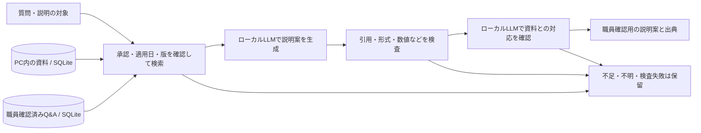

# Museum Evidence Lab

[](https://github.com/yutoo77/museum-evidence-lab/actions/workflows/ci.yml)

資料を外へ送らず、根拠を確かめながら説明を作る。科学館職員向けのローカルRAG比較アプリ。

> A local-first RAG workbench for source-grounded explanation drafts, reproducible evaluation, and honest failure analysis.

**職員が確認して使う研究・開発プロトタイプです。** 自動応答の正確性、完全な情報漏えい防止、実館での有効性を保証する完成製品ではありません。別展示の数値を取り違える既知の失敗も公開しています。

## なぜ作ったか

科学館の資料を外部AIへ送れなくても、職員が説明を準備する助けは作れます。一方、原文をそのまま並べるだけでは説明しづらく、自然な文章を生成すると資料にない理由や意図を補ってしまうことがあります。

このプロジェクトでは、**原文引用とLLMによる説明生成を比較し、読みやすさ・根拠への忠実さ・待ち時間を別々に検証**します。[Museum Evidence Assistant](https://github.com/yutoo77/museum-evidence-assistant)から発展させた比較版で、元のアプリと実行データを分離しています。

## できること

- PDF・TXT・MarkdownをPC内へ登録し、承認状態・適用日・同名資料の版を管理。
- 意味検索と日本語の語句検索を組み合わせて、関連する本文区画を取得。
- 複数の資料を使った説明案を生成。一般・子ども・職員向けと、説明の長さを選択。
- 職員が説明案を確認・修正して「確認済みQ&A」として保存。似た質問への次回の説明で参考にでき、元資料の更新時には再確認を求める。
- 段落ごとの引用、資料名、ページ、周辺の原文を折りたたみで確認。
- 原文引用・言い換え・限定再検索・旧2段階生成を、同じ評価基盤で比較。
- 途中終了、不正な引用、数値の一部、資料更新、処理時間超過などを検査して保留。

音声、カメラ、アバター、理解度の自動推定、外部検索は含みません。

## 回答の例

同梱の架空資料による開発用評価からの例です。実在する科学館の案内ではありません。

**質問**：影ができるしくみと、体験で何を動かして何を比べるのかを説明してください。

**説明案の一部**：

> 体験では光源とスクリーンの位置を動かさず、不透明な板をレールに沿って動かし、その前後で影の大きさを比べます。

説明文はLLMが作り、引用文は識別番号からプログラムが取り出します。「引用が原文に存在する」ことと「説明の意味が正しい」ことは区別します。UIの操作は[利用ガイド](LAB_GUIDE.md)、実際の出力・失敗の解釈は[検証結果](EXPLANATION_RESULTS.md)へ。

## 技術的なポイント

| 設計 | 理由・トレードオフ |
|---|---|
| 専用のローカルOllama・明示的なモデル許可リスト | 外部接続、リダイレクト、環境プロキシ、クラウドモデルを拒否。端末全体の通信遮断とは別 |
| SQLiteによる本文・版・ベクトルの管理 | 単一PCで保存と検索の対応を追いやすくする。大規模・多人数向けの設計ではない |
| 説明と引用を別のデータ型にする | 文章を原文コピーへ固定せず、複数の根拠を追跡する |
| 説明生成＋同じモデルの確認 | 最大2回で処理を制限。ただし同じ誤りを見逃し、待ち時間も増える |
| 旧FAQと職員確認済みQ&Aを区別 | 単一引用の旧FAQは比較方式向け。説明方式では編集・複数出典を扱えるQ&Aを参考候補にし、出典と検証を省略しない |
| フェイクを中心にしたテストと実モデル測定の分離 | CIはモデル不要。モデルの内容品質や実際の速度は別途測る |



主な技術：Python 3.11 / Streamlit / SQLite / Ollama / HTTPX / PyMuPDF / pytest / Ruff。
標準モデルは `qwen3:4b-instruct-2507-q4_K_M`、検索モデルは `embeddinggemma`。重みは同梱しません。比較版の実行にChromaDBは不要です。

## Windowsで動かす

Windows用の起動スクリプトを用意しています。初回はGit、Python 3.11（64bit）、[Ollama](https://ollama.com/download)を準備し、ネット接続のある環境で実行してください。モデル取得には数GB規模のディスク容量が必要です。応答時間はCPU・GPU・メモリに依存します。

### 1. コードとPython環境を準備

```powershell
git clone https://github.com/yutoo77/museum-evidence-lab.git
cd museum-evidence-lab
py -3.11 -m venv .venv
.\.venv\Scripts\python.exe -m pip install -r requirements-lab.txt
.\start_lab.cmd
```

画面は **http://127.0.0.1:8502/**。モデル未取得の場合は、まだ「AIを準備」を押さずに次へ進みます。起動スクリプトは専用Ollamaを11435番で起動し、既存の11434番とは分けます。

### 2. モデルを取得する（初回のみ）

別のPowerShellで実行します。設定する接続先はこのターミナル内だけです。

```powershell
$env:OLLAMA_HOST = '127.0.0.1:11435'
ollama pull embeddinggemma
ollama pull qwen3:4b-instruct-2507-q4_K_M
ollama list
```

### 3. 架空資料で試す

1. 画面の「AIを準備」を押す。
2. 「資料を管理」→「架空のサンプル資料を追加」→「サンプル5件を登録」。
3. 「資料を調べる」で「月の満ち欠けは、なぜ起こる？」と質問する。
4. 「説明案」と「この説明の根拠」を照合する。問題なければそのまま、必要なら文章を直して「職員確認済みQ&A」に保存する。
5. 似た質問で再検索し、参考にしたQ&Aと元資料の根拠を確認する。「原文から回答」に切り替えて比較もできる。
6. 根拠資料を同じ名前で更新すると、そのQ&Aは「再確認が必要」になり、再利用から外れる。

初回クローンに登録済み資料・索引・FAQ・確認済みQ&Aは含みません。以後は`start_lab.cmd`で起動、`stop_lab.cmd`で停止します。ブラウザを閉じるだけでは停止しません。

環境とモデルを用意した後は、通常利用でネット接続を必要としない構成です。物理的な閉域運用は[オフライン導入手順](OFFLINE_DEPLOYMENT.md)に従って別途確認してください。Linux/macOSでの起動スクリプトは提供していません。UbuntuのCIは処理の互換性確認で、GUI・施設運用の保証ではありません。

## 開発・検証

比較版だけを検証する軽量環境：

```powershell
.\.venv\Scripts\python.exe -m pip install -r requirements-lab-dev.txt
.\.venv\Scripts\python.exe -m pytest -q -k lab
.\.venv\Scripts\python.exe -m ruff check .
.\.venv\Scripts\python.exe -m compileall -q app.py lab_app.py src tests tools
```

全通常テストは`python -m pytest`で実行できます。Ollama不要で、ChromaDBがなければ旧版専用の9件（画面8件・保存1件）をスキップします。比較版の画面テストは別にあり、省略しません。旧版を完全再現する場合のみ、[セキュリティ上の注意](SECURITY.md)を読んだうえで`requirements-legacy.txt`を使用してください。

実モデルの評価は別に実行します（専用Ollamaを起動しておく）：

```powershell
.\.venv\Scripts\python.exe -m src.lab.evaluate --dataset benchmarks/explanation_dev/cases.jsonl --split dev --modes explain --models qwen3:4b-instruct-2507-q4_K_M --run-id my-first-evaluation
```

各実行は索引を分離し、モデル・コード・資料の識別情報と結果を`outputs/`へ保存します。同じ実行IDは上書きしません。詳しくは[評価用データ](benchmarks/explanation_dev/README.md)。

## 検証で分かったこと・限界

- 説明用の開発9問では、回答可能6問で説明を表示し、回答不可3問は保留。**正答率を示す数値ではありません。**
- その回答6件の完成時間は約9.5〜19.5秒、中央値13.58秒。1台・各1回・開発中の測定で、PC間の速度保証はしません。
- 既存24問では、**温室見学の時間を別の地層教室の35分から答える誤り**が確認を通過しました。
- 根拠のない目的の付加、過剰拒否、子ども向け説明の難しさも残ります。
- 未見データ、科学館職員・専門家による採点、実来館者での評価は未実施です。
- 確認済みQ&Aはモデルの再学習ではありません。人が確認した文章をローカルに保存する仕組みで、確認済みでも永久に正しいとは限りません。資料更新後は再確認が必要です。

公開するのは「正しく答える完成品」ではなく、**安全境界・比較・失敗分析を含めて設計を説明できるプロトタイプ**です。測定条件と失敗履歴は[EXPLANATION_RESULTS.md](EXPLANATION_RESULTS.md)、以前の引用方式は[LAB_RESULTS.md](LAB_RESULTS.md)で区別しています。

## 構成と追加資料

```text
lab_app.py                 # 日本語UI
src/lab/                  # 検索・ローカル通信・回答制御・評価
lab_config.yaml           # モデル許可リスト・検索条件
sample_docs/              # 自作の架空資料
benchmarks/               # 自作の評価資料・質問・検証条件
tests/                    # フェイク中心の回帰テスト
tools/                    # 通信診断・公開前チェック等
data/lab/, outputs/       # 実行時データ。Git管理外
```

`app.py`と旧`src/`の一部は旧方式との比較・互換性のために残しています。普段起動するのは`lab_app.py`です。

- [利用ガイド](LAB_GUIDE.md)：操作、比較方式、データ管理
- [セキュリティ](SECURITY.md)：保存内容、防御、残るリスク、報告先
- [公開前検証](PUBLICATION.md)：公開に含めるもの・除くもの、検証結果
- [貢献・再現手順](CONTRIBUTING.md)：テストと変更時の注意
- [ライセンス](LICENSE) / [第三者の利用条件](THIRD_PARTY_NOTICES.md)

AGPL-3.0-or-later。モデル・依存ライブラリにはそれぞれの条件が適用されます。研究用の内部資料、個人情報、モデルの重みは公開物へ含めません。GitHubで公開するのはコードであり、ローカルのアプリや登録資料をインターネットへ公開する操作ではありません。
